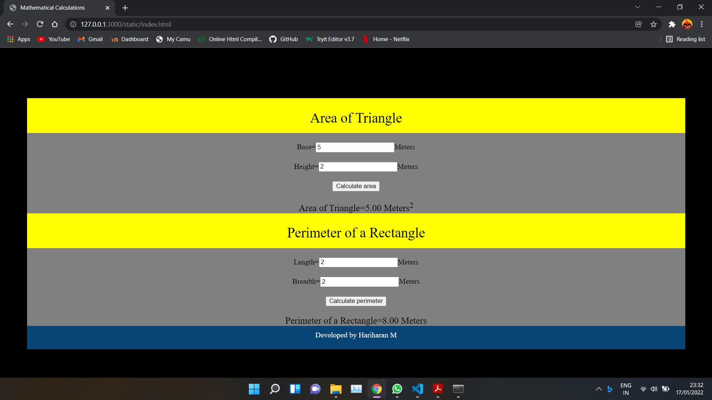
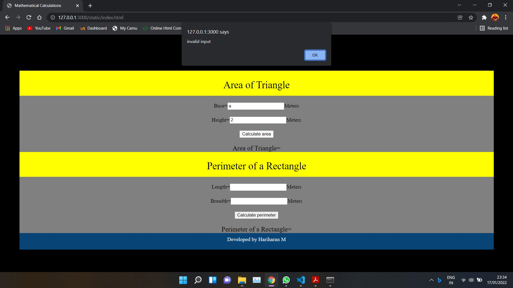
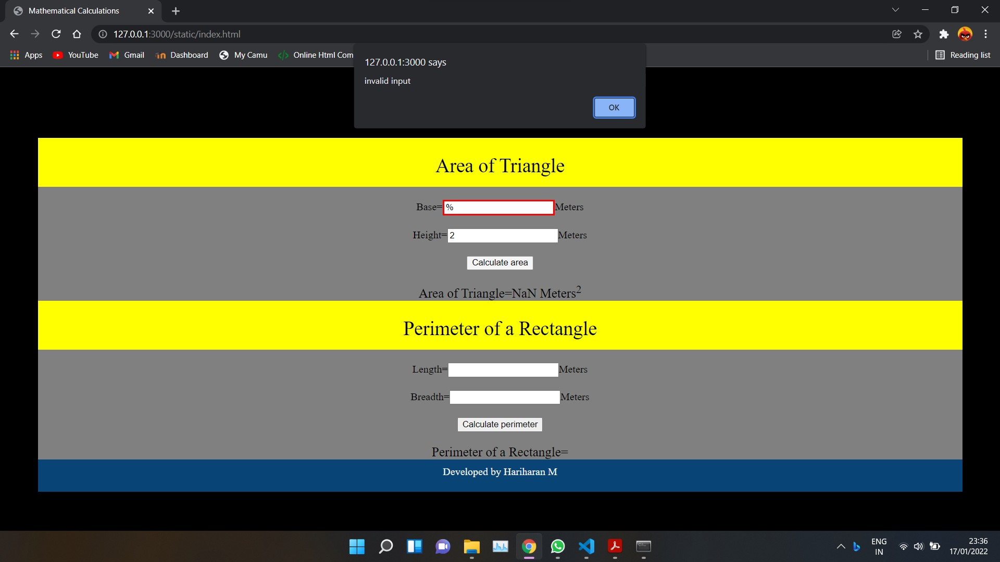

# Web Page for Mathematical Calculations

## AIM:

To design a static website with validation to perform mathematical calculations in client side.

## DESIGN STEPS:

### Step 1:

Requirement collection.

### Step 2:

Creating the layout using HTML and CSS.

### Step 3:

Write javascript to perform the calculations.

### Step 4:

Include regularexpression based input validation.

### Step 5:

Validate the layout in various browsers.

### Step 6:

Validate the HTML code.

### Step 6:

Publish the website in the given URL.

## PROGRAM :

### HTML code:
~~~
<!DOCTYPE html>
<html lang="en">
  <head>
    <meta charset="UTF-8" />
    <meta http-equiv="X-UA-Compatible" content="IE=edge" />
    <meta name="viewport" content="width=device-width, initial-scale=1.0" />
      <link rel="stylesheet" href="./x.css"/>
      
    <title>Mathematical Calculations</title>
  </head>
  <body>
    <h1>MATHEMATICAL CALCULATIONS</h1>
    

      
Area of Triangle
      

      

      Base=<input ="number" id= "input1" value="">Meters
      

      

      Height=<input ="number" id= "input2" value="">Meters
      

      

      <button id="bttn"
      onclick="validate();validate1();validate2();area();"> Calculate area</button>
      

      

      Area of Triangle=<input="number" id= "output1" value="">
      

      

      Perimeter of a Rectangle
      

      

      Length=<input ="number" id= "input3" value="">Meters
      

      

      Breadth=<input ="number" id= "input4" value="">Meters
      

      

      <button id="bttn"
      onclick="validate3();validate4();validate5();perimeter();"> Calculate perimeter</button>
      

      

      Perimeter of a Rectangle=<input="number" id= "output2" value="">
      

      

      Developed by Hariharan M
      

      

      </body>
      </html>
  </body>
</html>
~~~

### CSS code:
~~~
body
 {
 background-color:black;
 }
.container{
 margin-top:50px;
 margin-left:50px;
 margin-right:50px;
 background-color:grey;
 text-align:center;
}
.banner{
 padding-top:25px;
 background-color:yellow;
 height:50px;
 color:black;
 font-size:30px;
}
.content
{
 padding-top:20px;
}
.content1
{
 padding-top:20px;
 font-size:20px;
}
.footer {
 display: block;
 width: 100%;
 height: 40px;
 background-color: #084475;
 text-align: center;
 padding-top: 10px;
 margin: 0px 0px 0px 0px;
 color: whitesmoke;
}
~~~

### JAVASCRIPT code:
~~~
function validate() {
    var user = document.getElementById("input1").value;
    var user1 = document.getElementById("input1");
    var re = /^\d+$/;
    if (re.test(user))
    return true;
    else {
    user1.style.border = "red solid 3px";
    return false;}
    }
    function validate1() {
    var user2 = document.getElementById("input2").value;
    var user3 = document.getElementById("input2");
    var re = /^\d+$/;
    if(re.test(user2))
    return true;
    else{
    user3.style.border = "red solid 3px";
    return false;}
    }
    function validate2() {
    var user = document.getElementById("input1").value;
    var user1 = document.getElementById("input1");
    var user2 = document.getElementById("input2").value;
    var user3 = document.getElementById("input2");
    var re = /^\d+$/;
    if(re.test(user) && re.test(user2)) {
    alert("done");
    return true; }
    else {
    alert("invalid input");
    return false; }
    }
    function validate3() {
    var user4 = document.getElementById("input3").value;
    var user5 = document.getElementById("input3");
    var re = /^\d+$/;
    if (re.test(user4))
    return true;
    else {
    user5.style.border = "red solid 3px";
    return false;}
    }
    function validate4() {
    var user6 = document.getElementById("input4").value;
    var user7 = document.getElementById("input4");
    var re = /^\d+$/;
    if (re.test(user6))
    return true;
else {
user7.style.border = "red solid 3px";
return false;}
}
function validate5() {
var user4 = document.getElementById("input3").value;
var user5 = document.getElementById("input3");
var user6 = document.getElementById("input4").value;
var user7 = document.getElementById("input4");
var re = /^\d+$/;
if(re.test(user4) && re.test(user6)) {
alert("done");
return true; }
else {
alert("invalid input");
return false; }
}
function area() {
const num1 = document.getElementById("input1").value;
const num2 = document.getElementById("input2").value;
const area = 0.5*num1*1*num2*1;
document.getElementById("output1").innerHTML = area.toFixed(2)+" Meters"+"2".sup();
}
function perimeter() {
const num3 = document.getElementById("input3").value;
const num4 = document.getElementById("input4").value;
const per = 2*(num3*1+num4*1);
document.getElementById("output2").innerHTML = per.toFixed(2)+" Meters";
}
~~~

## OUTPUT:

## Result:

Thus a website is designed to perform mathematical calculations in the client side.
